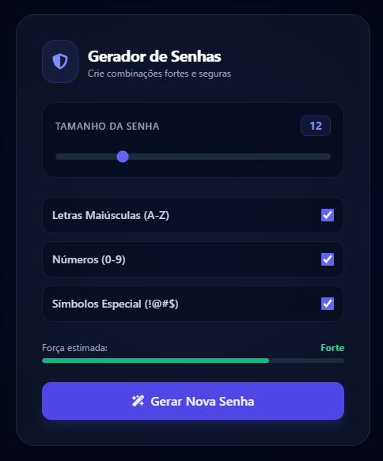

# 🔐 Gerador de Senhas Seguras Web

Uma aplicação web moderna, responsiva e segura desenvolvida com **Python (Flask)** para geração de senhas customizadas com critérios de complexidade e medidor de força em tempo real.

<p align="center">
  
</p>

<p align="center">
  🌐 <b>Acesse a aplicação online:</b> <a href="https://gerador-de-senhas-c1yl.onrender.com" target="_blank">gerador-de-senhas-c1yl.onrender.com</a>
</p>

---

## 🚀 Funcionalidades

- 🎲 **Geração Criptograficamente Segura:** Utiliza a biblioteca nativa `secrets` do Python para garantir aleatoriedade forte contra ataques de força bruta.
- 🎛️ **Customização Completa:** Controle total sobre o tamanho da senha (6 a 32 caracteres) e tipos de caracteres incluídos (Maiúsculas, Números e Símbolos Especiais).
- 📊 **Medidor de Força em Tempo Real:** Indicador dinâmico em JavaScript que calcula e exibe visualmente o nível de segurança (*Fraca*, *Média*, *Forte* e *Impenetrável*).
- 📋 **Cópia Rápida:** Botão para copiar a senha gerada diretamente para a área de transferência com feedback visual dinâmico no ícone.
- 🎨 **Design Moderno (Dark Mode):** Interface elegante em tom escuro no estilo *Glassmorphism*, totalmente responsiva para dispositivos móveis e desktop.

---

## 🛠️ Tecnologias Utilizadas

### **Backend**
- **[Python 3](https://www.python.org/):** Linguagem base do sistema.
- **[Flask](https://flask.palletsprojects.com/):** Microframework web responsável pelas rotas e renderização dos templates Jinja2.
- **[Gunicorn](https://gunicorn.org/):** Servidor HTTP WSGI de alta performance para ambiente de produção no Render.

### **Frontend**
- **[HTML5](https://developer.mozilla.org/pt-BR/docs/Web/HTML):** Estruturação semântica da interface.
- **[Tailwind CSS](https://tailwindcss.com/):** Framework CSS utilitário para estilização e responsividade.
- **[JavaScript (Vanilla)](https://developer.mozilla.org/pt-BR/docs/Web/JavaScript):** Manipulação de DOM para atualização do slider, cálculo da força da senha e evento de cópia.
- **[FontAwesome](https://fontawesome.com/):** Biblioteca de ícones vetoriais.

### **Infraestrutura & Ferramentas**
- **[GitHub Codespaces](https://github.com/features/codespaces):** Ambiente de desenvolvimento integrado na nuvem.
- **[Render](https://render.com/):** Plataforma de hospedagem com integração e deploy contínuo (CD) automatizado a cada `git push`.

---

## 💻 Como Executar o Projeto Localmente

### **Pré-requisitos**
Certifique-se de ter instalado em sua máquina:
- **Python 3.10+**
- **Git**

### **Passo a passo**

1. **Clonar o repositório:**
   ```bash
   git clone [https://github.com/thiagoed-souza/gerador-de-senhas.git](https://github.com/thiagoed-souza/gerador-de-senhas.git)
   cd gerador-de-senhas
